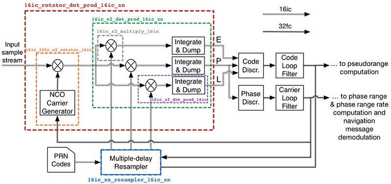

# Welcome to VOLK_GNSSSDR, the Vector-Optimized Library of Kernels for GNSS-SDR

VOLK_GNSSSDR is a sub-project of GNSS-SDR. This library provides a set of extra kernels that can be used stand-alone or in combination with VOLK's. Please see http://libvolk.org for documentation, source code, and contact information about the original VOLK library.

The boilerplate of this code was initially generated with ```volk_modtool```, an application provided by VOLK that creates the skeleton than can then be filled with custom kernels. Some modifications were added to accomodate the specificities of Global Navigation Satellite Systems (GNSS) signal processing. Those changes are clearly indicated in the source code, and do not break compatibility.

This library contains kernels of hand-written SIMD code for different mathematical operations, mainly with 8-bit and 16-bit real and complex data types, offering a platform/architecture agnostic version that will run in all machines, plus other versions for different SIMD instruction sets. Then, the application ```volk_gnsssdr_profile``` runs some iterations of all versions that your machine can execute and annotates which is the fastest, which will then be selected at runtime when executing GNSS-SDR. In this way, we can address at the same time portability (by creating executables that will run in nearly all processor architectures) and efficiency (by providing custom implementations specially designed to take advantage of the specific processor that is running the code).

These kernels have some specific features (e.g. saturation arithmetics) that are aimed to GNSS signal processing, but could make them not suitable for its general use in other applications. Check out the documentation generated by Doxygen and the *generic* (that is, plain C) implementation to see what each kernel is actually doing.

## How to use VOLK_GNSSSDR:

This library is automatically built and installed along with GNSS-SDR if it is not found by CMake on your system at configure time.

However, you can install and use VOLK_GNSSSDR kernels as you use VOLK's, independently from GNSS-SDR.

First, make sure that the required dependencies are installed in you machine:

~~~~~~ 
$ sudo apt-get install git subversion cmake python-cheetah libboost-dev libbbost-filesystem
~~~~~~ 

In order to build and install the library, go to the base folder of the source code and do:

~~~~~~ 
$ mkdir build
$ cd build
$ cmake ..
$ make
$ sudo make install
~~~~~~ 

That's it!

Before its first use, please execute ```volk_gnsssdr_profile``` to let your system know which is the fastest available implementation. This only has to be done once:

~~~~~~ 
$ volk_gnsssdr_profile
~~~~~~

From now on, GNSS-SDR (and any other program of your own that makes use of VOLK_GNSSSDR) will benefit from the acceleration provided by SIMD instructions available in your processor.

This figure shows the role of some VOLK_GNSSSDR kernels in the context of a GNSS baseband processor:




If you use VOLK_GNSSSDR in your research and/or software, please cite the following paper:

 * C. Fern&aacute;ndez-Prades, J. Arribas, P. Closas, *Accelerating GNSS Software Receivers*, in Proc. of the ION GNSS+ 2016 Conference, Portland, Oregon, Sept. 12-16, 2016.

Citations are useful for the continued development and maintenance of the library.


___

VOLK_GNSSSDR was originally created by Andres Cecilia Luque in the framework of the [Summer Of Code In Space (SOCIS 2014)](http://sophia.estec.esa.int/socis2014/?q=about "SOCIS 2014 webpage") program organized by the European Space Agency, and then evolved and maintained by Carles Fern&aacute;ndez-Prades and Javier Arribas. This software is released under the GNU General Public License version 3, see the file COPYING.

This project is managed by [Centre Tecnologic de Telecomunicacions de Catalunya](http://www.cttc.es "CTTC webpage").
